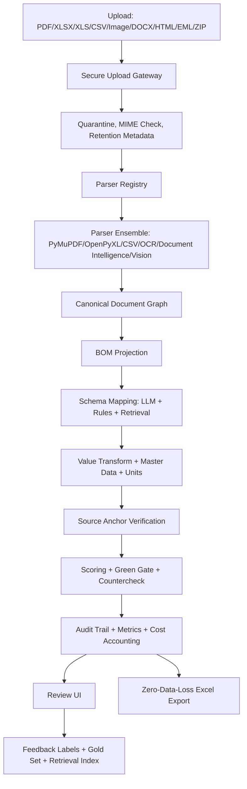

# Umsetzungs-Backlog: Maximale Formatunabhaengigkeit und Output-Qualitaet

Stand: 2026-06-04  
Ziel: Dieses Backlog ist so geschrieben, dass einzelne Tickets von KI-Agenten wie GitHub Copilot, Claude Code oder Codex nacheinander abgearbeitet werden koennen. Es setzt die komplette Review-Tabelle in eine technische Umsetzungsreihenfolge um.

## Leitprinzipien

1. Keine stillen Datenverluste. Ein Export darf nie weniger fachliche Zeilen enthalten als die Pipeline als relevant erkannt hat.
2. Keine falschen Gruen-Bewertungen. Gruen bedeutet automatisch uebernehmbar; Gelb bedeutet Review; Rot bedeutet manuelle Klaerung.
3. Formatunabhaengigkeit entsteht ueber ein Canonical Document Model, nicht ueber kunden- oder format-spezifische Sonderregeln.
4. Jede KI-Entscheidung braucht Provenance: Quelle, Seite, Bounding Box oder Zelladresse, Parser-Spur, Prompt-Version und Score-Begruendung.
5. Jede Aenderung muss durch Tests, Gold-Daten oder messbare Telemetrie abgesichert werden.
6. Security, Secrets, Auth, Retention und Audit sind keine spaeten Extras, sondern Voraussetzung fuer produktive Nutzung.
7. Kein Multi-Tenant-Overengineering. Das System bleibt Single-Instance, bekommt aber produktionsfaehige Rollen, Audit und Betriebsfaehigkeit.

## Arbeitsregeln fuer KI-Agenten

- Immer genau ein Ticket oder eine klar abgegrenzte Ticket-Gruppe bearbeiten.
- Vor Codeaenderungen die im Ticket genannten Dateien lesen und die aktuelle Implementierung bestaetigen.
- Keine kundenspezifischen Heuristiken fuer einzelne POC-Dateien einbauen.
- Neue Parser, Scorer, Policies und LLM-Aufrufe muessen hinter klaren Interfaces liegen.
- Bestehende Benutzer- oder ungetrackte Aenderungen nicht zuruecksetzen.
- Neue Tests gehoeren direkt zum Ticket.
- Nach jedem Ticket mindestens einen passenden Validierungsbefehl ausfuehren.
- Wenn Azure- oder Secret-Informationen fehlen, mit Platzhaltern und dokumentierter Konfiguration arbeiten, keine echten Secrets einchecken.

## Fortschritt und Agenten-Kontext

Der laufende Bearbeitungsstand wird in [backlog_status.md](backlog_status.md) gepflegt. Diese Datei ist der gemeinsame Arbeits- und Uebergabespeicher fuer KI-Agenten.

Pflichtprozess fuer jedes Ticket:

1. Vor Start `backlog.md` und `backlog_status.md` lesen.
2. Ticket in `backlog_status.md` auf `IN_PROGRESS` setzen und eine kurze Startnotiz eintragen.
3. Nur die im Ticket benoetigten Dateien aendern.
4. Passende Validierung ausfuehren und Ergebnis in `backlog_status.md` dokumentieren.
5. Ticket erst auf `DONE` setzen, wenn Akzeptanzkriterien und Validierung erfuellt sind.
6. Bei Blockern Status `BLOCKED` setzen, Ursache, fehlende Entscheidung und naechsten Schritt dokumentieren.
7. Neue Architekturentscheidungen, Learnings, Kommandos und Risiken im Abschnitt `Agent Context Log` in `backlog_status.md` festhalten.

## Empfohlene Standard-Validierung

Je nach Ticket eine passende Teilmenge ausfuehren:

```powershell
python -m pytest tests -q
python -m pytest tests/test_upload_security.py tests/test_job_queue.py tests/test_export_zero_data_loss.py -q
python -m pytest tests/test_zero_false_positive.py tests/test_false_green_vision.py -q
python -m pytest tests/test_llm_column_mapper_prompt.py tests/test_mapping_value_evidence.py -q
python -m pytest tests/test_master_data_matcher.py tests/test_transform.py tests/test_scoring.py -q
```

Frontend, wenn betroffen:

```powershell
Set-Location frontend
npm test
npm run build
```

Security/Build, wenn vorhanden bzw. nach CI-Einfuehrung:

```powershell
python -m pip install pip-audit
pip-audit
npm audit --audit-level=high
docker build -f Dockerfile.backend -t schaufler-bom-backend:local .
docker build -f frontend/Dockerfile -t schaufler-bom-frontend:local frontend
```

## Zielarchitektur nach Umsetzung



## Phasenplan

| Phase | Ziel | Ticket-Bereich | Ergebnis |
|---|---|---|---|
| 0 | Sicherheits- und Reproduzierbarkeitsbasis | B001-B017 | Keine Secrets im Repo, sichere Defaults, CI, Locks, Upload-Vertrag repariert |
| 1 | Messbarkeit und Gold-Basis | B018-B030 | Qualitaet, False Green, Table Recall und Prompt-Versionen messbar |
| 2 | Canonical Document Model und Parser-Architektur | B031-B045 | Formatunabhaengige Ingestion-Basis mit Provenance |
| 3 | Scan/OCR/Vision-Robustheit | B046-B055 | Unabhaengige Scan-Spur, OCR/Layout-Checks, adaptive Vision |
| 4 | Mapping, RAG, LLM-Orchestrierung | B056-B066 | Bessere Mappings, strukturierte Outputs, Retrieval fuer Wissen und Korrekturen |
| 5 | Scoring, Policies und Output-Qualitaet | B067-B075 | Feldpolitiken, Excel-Gruen-Policy, Unit Engine, staerkere Verifikation |
| 6 | Plattform, Observability und Skalierung | B076-B083 | Tracing, Metrics, Worker, Storage, DB, Release-Infos |
| 7 | UX, Produktworkflow und Lernen | B084-B089 | Review beschleunigt, Feedback verwertbar, Reports, Active Learning |
| 8 | Explizite Ergaenzungen aus der Ausgangstabelle | B090-B100 | Retention, OIDC, Release, Backup, IaC, Pagination, Streaming und ADRs |

## Abhaengigkeitsregeln

- B001-B017 vor produktiven Deployments erledigen.
- B018-B030 vor riskanten Parser-, LLM- oder Green-Gate-Aenderungen erledigen.
- B031 Canonical Document Model vor neuen Formaten wie DOCX, EML, ZIP und Image stabilisieren.
- B046-B055 vor Gruen-Freigaben fuer Scan- oder Vision-only-Dokumente erledigen.
- B056-B066 nur mit Prompt-Versionierung und Gold-Eval aus Phase 1 produktiv schalten.
- B076-B083 vor hohem Dokumentvolumen oder mehreren gleichzeitigen Reviewern einplanen.

---

## Phase 0: Security, Upload-Vertrag, CI und reproduzierbare Basis

### B001 - Secret Hygiene `.env.example`

- Kategorie: Security
- Prioritaet: P0
- Aufwand: S
- Abhaengigkeiten: Azure-Zugang fuer Key-Rotation
- Ausgangslage: `.env.example` enthaelt echte oder echt wirkende Azure-Key-Werte und unsichere Defaults.
- Dateien: `.env.example`, `.gitignore`, `README.md`
- Aufgaben:
  - Alle echten oder echt wirkenden Secrets durch Platzhalter ersetzen.
  - Dokumentieren, dass kompromittierte Keys rotiert werden muessen.
  - Sicherstellen, dass `.env` und `.env.*` ignoriert bleiben, `.env.example` aber nur Platzhalter enthaelt.
  - Optional lokale Secret-Scan-Anleitung im README ergaenzen.
- Akzeptanzkriterien:
  - Kein API-Key, Token, Passwort oder produktiver Endpoint in `.env.example`.
  - Startdokumentation erklaert, welche Variablen gesetzt werden muessen.
- Validierung:
  - `git grep -n "AZURE_OPENAI_KEY\|admin/admin\|sk-\|api_key" -- .env.example README.md`

### B002 - Default Admin deaktivieren

- Kategorie: Security
- Prioritaet: P0
- Aufwand: S
- Abhaengigkeiten: B001
- Ausgangslage: Login mit `admin/admin` ist per Default moeglich.
- Dateien: `src/core/auth.py`, `src/api/routes/auth.py`, `.env.example`, Tests fuer Auth
- Aufgaben:
  - Produktivmodus einfuehren oder vorhandene Env-Flags nutzen, sodass Default-Admin in Produktion verboten ist.
  - Wenn kein Admin-Secret gesetzt ist, soll die App im Produktivmodus fail-fast starten.
  - Tests fuer Default-Admin erlaubt in Dev und verboten in Prod ergaenzen.
- Akzeptanzkriterien:
  - `admin/admin` funktioniert nur bei explizitem Dev-Flag.
  - Fehlkonfiguration wird beim Start klar gemeldet.
- Validierung:
  - `python -m pytest tests/test_auth*.py tests/test_upload_security.py -q`

### B003 - CSRF-Schutz fuer Cookie-Auth

- Kategorie: Security
- Prioritaet: P0
- Aufwand: S/M
- Abhaengigkeiten: B002
- Ausgangslage: State-changing API-Endpunkte verwenden Cookie-Auth, aber kein expliziter CSRF-Schutz ist sichtbar.
- Dateien: `src/api/main.py`, `src/api/routes/auth.py`, Frontend API-Client
- Aufgaben:
  - CSRF-Token beim Login ausgeben oder Origin/Referer-Pruefung fuer mutierende Requests einfuehren.
  - Frontend so anpassen, dass mutierende Requests Token/Header senden.
  - Tests fuer fehlendes, falsches und korrektes Token schreiben.
- Akzeptanzkriterien:
  - POST/PUT/PATCH/DELETE auf Job-, Feedback- und Settings-Endpunkte werden ohne Schutz abgelehnt.
  - API-Key-basierte interne Requests bleiben sauber definiert.
- Validierung:
  - `python -m pytest tests/test_auth*.py tests/test_upload_security.py -q`

### B004 - Rate Limit per User/IP

- Kategorie: Security/Perf
- Prioritaet: P0
- Aufwand: S/M
- Abhaengigkeiten: B002
- Ausgangslage: Login, Upload und LLM-ausloesende Endpunkte sind nicht sichtbar gedrosselt.
- Dateien: `src/api/main.py`, `src/api/routes/upload.py`, `src/api/routes/auth.py`
- Aufgaben:
  - Lightweight Rate-Limit-Middleware fuer Login und Upload einfuehren.
  - Limits konfigurierbar machen.
  - Tests fuer Burst und Reset-Fenster schreiben.
- Akzeptanzkriterien:
  - Bruteforce-Login und Upload-Spam werden begrenzt.
  - Fehlermeldung ist API-tauglich und enthaelt Retry-Hinweis.
- Validierung:
  - `python -m pytest tests/test_upload_security.py tests/test_auth*.py -q`

### B005 - Login Lockout

- Kategorie: Security
- Prioritaet: P0
- Aufwand: S
- Abhaengigkeiten: B002, B004
- Ausgangslage: Wiederholte falsche Logins werden nicht dauerhaft begrenzt.
- Dateien: `src/core/auth.py`, `src/api/job_store.py` oder eigene Auth-Store-Datei
- Aufgaben:
  - Fehlversuche je Benutzer/IP speichern.
  - Lockout-Dauer und Max-Versuche konfigurierbar machen.
  - Tests fuer Lockout und automatisches Entsperren schreiben.
- Akzeptanzkriterien:
  - Nach definierten Fehlversuchen wird Login temporaer blockiert.
  - Erfolgreicher Login setzt Zaehler zurueck.
- Validierung:
  - `python -m pytest tests/test_auth*.py -q`

### B006 - Settings RBAC

- Kategorie: Security/UX
- Prioritaet: P0
- Aufwand: M
- Abhaengigkeiten: B002
- Ausgangslage: Admin-Endpunkte sind nicht sauber von Reviewer-Funktionen getrennt.
- Dateien: `src/core/auth.py`, `src/api/routes/settings.py`, `src/api/routes/jobs.py`, Frontend Settings UI
- Aufgaben:
  - Rollenmodell `admin` und `reviewer` einfuehren.
  - Settings, Masterdata und System-Endpunkte auf Admin beschraenken.
  - Job-Review-Funktionen fuer Reviewer erlauben.
  - Frontend blendet Admin-Bereiche rollenbasiert aus.
- Akzeptanzkriterien:
  - Reviewer kann keine Config/Masterdata aendern.
  - Admin kann Settings weiter verwalten.
- Validierung:
  - `python -m pytest tests/test_auth*.py tests/test_settings*.py -q`

### B007 - MIME/Magic-Validation

- Kategorie: Security/Ingestion
- Prioritaet: P0
- Aufwand: S
- Abhaengigkeiten: B001
- Ausgangslage: Upload vertraut stark auf Dateiendungen.
- Dateien: `src/api/routes/upload.py`, `src/ingestion/file_router.py`, Tests
- Aufgaben:
  - Magic-Byte- oder MIME-Erkennung einfuehren.
  - Extension und erkannter Typ muessen kompatibel sein.
  - Spoofing-Fixtures fuer PDF/XLSX/CSV schreiben.
- Akzeptanzkriterien:
  - Umbenannte Schad- oder Textdateien werden nicht als PDF/XLSX akzeptiert.
  - Fehlermeldung nennt erlaubte Formate.
- Validierung:
  - `python -m pytest tests/test_upload_security.py -q`

### B008 - CSV wirklich parsen

- Kategorie: Ingestion
- Prioritaet: P0
- Aufwand: S
- Abhaengigkeiten: B007, Testdateien
- Ausgangslage: Upload erlaubt CSV, `parse_file` verarbeitet CSV aber nicht.
- Dateien: `src/ingestion/structure_normalizer.py`, `src/ingestion/file_router.py`, neue Tests
- Aufgaben:
  - CSV/TSV-Dialekterkennung fuer Separator, Encoding, Header-Zeile implementieren.
  - CSV in `ParsedBOM` mit Zeilen- und Spaltenprovenance ueberfuehren.
  - Tests fuer Komma, Semikolon, Tab, UTF-8, Windows-1252 schreiben.
- Akzeptanzkriterien:
  - CSV-Upload erzeugt ein valides `ParsedBOM`.
  - Fehlerhafte CSVs landen nicht still im PDF/Excel-Fallback.
- Validierung:
  - `python -m pytest tests/test_ingestion* tests/test_job_source_route.py -q`

### B009 - XLS Legacy korrekt behandeln

- Kategorie: Ingestion
- Prioritaet: P0
- Aufwand: S/M
- Abhaengigkeiten: Beispiel-XLS oder klare Produktentscheidung
- Ausgangslage: `.xls` wird erlaubt, `openpyxl` deckt Legacy-XLS nicht sauber ab.
- Dateien: `src/api/routes/upload.py`, `src/ingestion/excel_parser.py`, `src/ingestion/file_router.py`
- Aufgaben:
  - Entscheidung: `.xls` blocken oder per LibreOffice/calamine konvertieren.
  - Wenn blocken: klare Fehlermeldung und Dokumentation.
  - Wenn konvertieren: isolierten Konvertierungsschritt mit Timeout und Tests bauen.
- Akzeptanzkriterien:
  - `.xls` fuehrt nie zu kryptischem `openpyxl`-Fehler.
  - Produktentscheidung ist dokumentiert.
- Validierung:
  - `python -m pytest tests/test_upload_security.py tests/test_job_source_route.py -q`

### B010 - Source Cell Provenance Excel

- Kategorie: Ingestion/QA
- Prioritaet: P0
- Aufwand: S/M
- Abhaengigkeiten: B008, B009
- Ausgangslage: Excel-Werte haben weniger exakte Source-Provenance als PDF-Textlayer.
- Dateien: `src/ingestion/excel_parser.py`, `src/core/models.py`, Scoring/Audit Tests
- Aufgaben:
  - SourceLocation fuer Excel mit `sheet`, `row`, `column`, `address`, `value` erweitern.
  - Transform- und Scoring-Pipeline muss Zelladressen im Audit erhalten.
  - Review UI soll Excel-Source-Adressen anzeigen koennen.
- Akzeptanzkriterien:
  - Jeder Excel-Zielwert kann auf eine Quellzelle zurueckgefuehrt werden.
  - Audit Trail zeigt Sheet und Zelladresse.
- Validierung:
  - `python -m pytest tests/test_mapping_value_evidence.py tests/test_scoring.py -q`

### B011 - Config Schema Validation

- Kategorie: DevEx
- Prioritaet: P0
- Aufwand: M
- Abhaengigkeiten: keine
- Ausgangslage: YAML-Config kann zur Laufzeit fehlschlagen.
- Dateien: `src/config.py`, `config/app_config.yaml`, Tests
- Aufgaben:
  - Pydantic-Settings-Modell fuer alle bekannten Config-Werte einfuehren.
  - Defaults explizit dokumentieren.
  - Fail-fast bei ungueltigen Thresholds, Pfaden und Security-Flags.
- Akzeptanzkriterien:
  - Ungueltige Config wird beim Start mit klarer Meldung abgelehnt.
  - Tests decken gueltige und ungueltige Config ab.
- Validierung:
  - `python -m pytest tests/test_config*.py -q`

### B012 - Dependency Pinning

- Kategorie: DevEx/Security
- Prioritaet: P0
- Aufwand: M
- Abhaengigkeiten: Toolwahl, z. B. pip-tools oder uv
- Ausgangslage: Python-Dependencies sind nicht voll reproduzierbar gepinnt.
- Dateien: `requirements.txt`, optional `requirements.lock`, `frontend/package-lock.json`
- Aufgaben:
  - Python-Lockfile mit festen Versionen und reproduzierbarem Installationspfad einfuehren.
  - Frontend Lockfile pruefen und Audit-Prozess dokumentieren.
  - README-Installationsbefehle aktualisieren.
- Akzeptanzkriterien:
  - Frischer Checkout installiert reproduzierbar.
  - Security-Audits laufen deterministisch.
- Validierung:
  - `python -m pip install -r requirements.txt`
  - `Set-Location frontend; npm ci`

### B013 - CI Pipeline

- Kategorie: CI/CD
- Prioritaet: P0
- Aufwand: M
- Abhaengigkeiten: B012
- Ausgangslage: Keine GitHub Actions oder vergleichbare CI sichtbar.
- Dateien: `.github/workflows/ci.yml`, README
- Aufgaben:
  - CI fuer Python Tests, Ruff/Lint, Frontend Tests und Frontend Build einfuehren.
  - Live-Azure-Tests separieren und standardmaessig deaktivieren.
  - Artifacts fuer Testberichte optional speichern.
- Akzeptanzkriterien:
  - Pull Request kann nicht ohne Basischecks gemerged werden.
  - Tests sind ohne echte Secrets lauffaehig.
- Validierung:
  - Lokale Entsprechung der CI-Kommandos ausfuehren.

### B014 - SAST/Dependency Scans

- Kategorie: Security/CI
- Prioritaet: P0
- Aufwand: M
- Abhaengigkeiten: B013
- Ausgangslage: Keine automatisierten SAST- oder CVE-Gates sichtbar.
- Dateien: `.github/workflows/security.yml`, Dockerfiles, README
- Aufgaben:
  - CodeQL oder vergleichbare SAST fuer Python/TypeScript aktivieren.
  - `pip-audit`, `npm audit` und Docker-Image-Scan einbinden.
  - Policy fuer kritische Findings definieren.
- Akzeptanzkriterien:
  - Kritische CVEs blockieren Releases.
  - Findings sind nachvollziehbar dokumentiert.
- Validierung:
  - `python -m pip install pip-audit; pip-audit`
  - `Set-Location frontend; npm audit --audit-level=high`

### B015 - Container Hardening

- Kategorie: Security/Deploy
- Prioritaet: P0
- Aufwand: S
- Abhaengigkeiten: B012
- Ausgangslage: Docker-Images koennen Runtime-Daten oder Root-Ausfuehrung enthalten.
- Dateien: `Dockerfile.backend`, `frontend/Dockerfile`, `.dockerignore`, `docker-compose.yml`
- Aufgaben:
  - Non-root User fuer Backend und Frontend setzen.
  - `.dockerignore` ergaenzen: `.env`, `data/uploads`, `data/exports`, `.venv`, `.git`, `node_modules`.
  - Healthcheck definieren.
  - Keine Kundendaten ins Image kopieren.
- Akzeptanzkriterien:
  - Container laufen als non-root.
  - Image enthaelt keine lokalen Uploads/Exports/Secrets.
- Validierung:
  - `docker build -f Dockerfile.backend -t schaufler-bom-backend:local .`

### B016 - Separate Demo/Test Data

- Kategorie: Security/Deploy
- Prioritaet: P0
- Aufwand: S
- Abhaengigkeiten: B015
- Ausgangslage: `data/` kann versehentlich in Images oder Artefakte geraten.
- Dateien: `.dockerignore`, `Dockerfile.backend`, `README.md`
- Aufgaben:
  - Demo-Daten klar von Runtime-Daten trennen.
  - Docker-Build darf keine Uploads, Exports oder Jobs-DB kopieren.
  - README erklaert Runtime-Volume.
- Akzeptanzkriterien:
  - Build-Kontext enthaelt keine produktiven Daten.
  - Demo-Modus ist explizit.
- Validierung:
  - Docker-Build und manuelle Image-Inspektion.

### B017 - Health Checks Deep

- Kategorie: SRE
- Prioritaet: P0
- Aufwand: S
- Abhaengigkeiten: B011
- Ausgangslage: Healthcheck ist nicht tief genug fuer produktive Readiness.
- Dateien: `src/api/main.py`, `src/api/routes/settings.py` oder neue `health.py`
- Aufgaben:
  - `/health/live` fuer Prozess lebt.
  - `/health/ready` fuer Config, Template, DB, Schreibrechte, optional Azure Connectivity.
  - Docker/Compose Healthcheck auf Readiness setzen.
- Akzeptanzkriterien:
  - Fehlende Vorlage oder kaputte DB fuehrt zu not-ready.
  - Liveness bleibt stabil fuer Orchestrierung.
- Validierung:
  - `python -m pytest tests/test_health*.py -q`

---

## Phase 1: Evaluation, Gold Set, Prompt-Versionierung und Qualitaetsgates

### B018 - Gold Set mit Feld-Level Labels

- Kategorie: Evaluation
- Prioritaet: P0
- Aufwand: L
- Abhaengigkeiten: Fachreview, Beispiel-Dokumente
- Ausgangslage: Es gibt viele Tests, aber keinen vollstaendigen Gold-Korpus mit erwarteten Zellen und Provenance.
- Dateien: `data/gold/`, `tests/`, `scripts/`
- Aufgaben:
  - Gold-Format definieren: Dokument, erwartete Zeilen, Felder, Werte, Source-Anker, erlaubte Normalisierungen.
  - Mindestens 10 repraesentative Dokumente labeln: Text-PDF, Scan-PDF, XLSX, CSV.
  - Reviewer-Korrekturen als Kandidaten fuer Gold-Daten nutzbar machen.
- Akzeptanzkriterien:
  - Gold-Daten koennen ohne Azure-Secrets fuer deterministische Teile geprueft werden.
  - Feld-Level Precision/Recall berechenbar.
- Validierung:
  - `python scripts/run_benchmark.py --input-dir data/gold --expected data/gold/expected.json`

### B019 - Benchmark Harness

- Kategorie: Evaluation
- Prioritaet: P0
- Aufwand: M
- Abhaengigkeiten: B018
- Ausgangslage: Diagnose-Skripte sind verteilt, Metriken nicht zentral.
- Dateien: `scripts/run_benchmark.py`, `tests/test_regression.py`, `data/analysis/`
- Aufgaben:
  - Zentralen Runner fuer Parser Recall, Column Mapping Accuracy, Field Precision, False Green Rate und Export Completeness bauen.
  - JSON- und Markdown-Report erzeugen.
  - Exit-Code fuer CI-Gates unterstuetzen.
- Akzeptanzkriterien:
  - Benchmark liefert reproduzierbare Metriken pro Dokument und aggregiert.
  - Regressionen koennen CI blockieren.
- Validierung:
  - `python scripts/run_benchmark.py --input-dir data/gold --expected data/gold/expected.json`

### B020 - Table Structure Metrics

- Kategorie: QA
- Prioritaet: P0
- Aufwand: M
- Abhaengigkeiten: B018, B019
- Ausgangslage: Tabellenstruktur wird nicht systematisch mit Row/Column/Cell-Metriken bewertet.
- Dateien: `scripts/run_benchmark.py`, `src/ingestion/coordinate_table.py`, Gold-Schema
- Aufgaben:
  - Row Recall, Column F1, Cell Alignment Score und Header Accuracy definieren.
  - Metriken fuer PDF, Excel und CSV ausgeben.
  - Problematische Dokumente mit Fehlerklassen markieren.
- Akzeptanzkriterien:
  - Parser-Verbesserungen sind messbar statt subjektiv.
  - CI kann Mindestwerte fuer Gold-Daten pruefen.
- Validierung:
  - Benchmark-Report enthaelt Table-Structure-Abschnitt.

### B021 - False-Green Canary Suite

- Kategorie: QA
- Prioritaet: P0
- Aufwand: M
- Abhaengigkeiten: B018
- Ausgangslage: Zero-False-Positive-Tests existieren, sollen aber als Canary-Suite ausgebaut werden.
- Dateien: `tests/test_zero_false_positive.py`, `tests/test_false_green_vision.py`, neue Fixtures
- Aufgaben:
  - Adversarial Fixtures fuer vertauschte Menge/Position, fehlende SourceLocation, repariertes LLM-JSON, Scan-Unsicherheit, Material ohne Evidenz erstellen.
  - Erwartung: niemals Gruen bei nicht unabhaengig verifizierbarer Quelle.
  - Canary-Tests in CI immer laufen lassen.
- Akzeptanzkriterien:
  - Jeder bekannte False-Green-Risikopfad hat einen Test.
  - Neue Scoring-Aenderungen muessen Canary bestehen.
- Validierung:
  - `python -m pytest tests/test_zero_false_positive.py tests/test_false_green_vision.py -q`

### B022 - Scan Under-Extraction Test

- Kategorie: QA
- Prioritaet: P0
- Aufwand: M
- Abhaengigkeiten: B018
- Ausgangslage: Vision kann bei Scan-Dokumenten Zeilen uebersehen, ohne unabhaengigen Anker.
- Dateien: `tests/test_vision_multi.py`, `tests/test_false_green_vision.py`, neue Scan-Fixtures
- Aufgaben:
  - Fixture mit bekannter Positionsanzahl und simulierter Missing-Row bauen.
  - Erwartung: Vollstaendigkeit nicht garantiert, keine Gruen-Freigabe fuer betroffene Zellen.
  - Fehlergrund im Audit sichtbar machen.
- Akzeptanzkriterien:
  - Scan-Unterextraktion wird als Risiko erkannt.
  - Betroffene Werte werden Gelb/Rot, nicht Gruen.
- Validierung:
  - `python -m pytest tests/test_false_green_vision.py tests/test_vision_multi.py -q`

### B023 - Customer-Independent Eval Split

- Kategorie: Evaluation
- Prioritaet: P0
- Aufwand: L
- Abhaengigkeiten: B018
- Ausgangslage: Risiko, dass Verbesserungen zu stark auf bekannte POC-Dokumente optimiert werden.
- Dateien: `data/gold/`, `scripts/run_benchmark.py`, Dokumentation
- Aufgaben:
  - Gold-Daten in Train/Dev/Holdout trennen.
  - Holdout enthaelt neue Layouts/Sprachen/Kunden, nicht im Prompt oder als Heuristik erlaubt.
  - Benchmark zeigt getrennte Scores.
- Akzeptanzkriterien:
  - Holdout bleibt ungesehen fuer Implementierung.
  - Release-Entscheidung nutzt Holdout-Metriken.
- Validierung:
  - Benchmark-Report zeigt Dev und Holdout separat.

### B024 - Model/Prompt Eval Matrix

- Kategorie: LLM/Eval
- Prioritaet: P0
- Aufwand: M
- Abhaengigkeiten: B018, B019
- Ausgangslage: Modell- oder Promptwechsel sind nicht systematisch vergleichbar.
- Dateien: `src/llm/`, `prompts/`, `scripts/evaluate_prompts.py`
- Aufgaben:
  - Matrix aus Prompt-Version, Modell-Deployment, Temperatur, JSON/Schema-Modus definieren.
  - Gold-Daten gegen Varianten laufen lassen.
  - Metriken: Mapping Accuracy, JSON Fail Rate, Kosten, Latenz.
- Akzeptanzkriterien:
  - Promptwechsel ohne Eval ist nicht releasefaehig.
  - Beste Variante wird datenbasiert gewaehlt.
- Validierung:
  - `python scripts/evaluate_prompts.py --gold data/gold`

### B025 - Prompt Registry mit Versionen

- Kategorie: LLM/DevEx
- Prioritaet: P0
- Aufwand: M
- Abhaengigkeiten: B024
- Ausgangslage: Prompts sind teils Datei, teils Code, ohne Version/Hash im Audit.
- Dateien: `prompts/`, `src/llm/prompt_manager.py`, `src/mapping/llm_column_mapper.py`, Audit Trail
- Aufgaben:
  - Prompt-Metadaten einfuehren: Name, Version, Hash, Zweck, Input-Schema, Output-Schema.
  - Jeder LLM-Call schreibt Prompt-Version und Hash in Audit/Metrics.
  - Tests fuer stabile Prompt-Renderings.
- Akzeptanzkriterien:
  - Jeder Job ist prompt-reproduzierbar.
  - Prompt-Aenderungen sind im Benchmark sichtbar.
- Validierung:
  - `python -m pytest tests/test_llm_column_mapper_prompt.py -q`

### B026 - Parser Failure Taxonomy

- Kategorie: Observability/QA
- Prioritaet: P1
- Aufwand: S/M
- Abhaengigkeiten: B019
- Ausgangslage: Parserfehler sind nicht standardisiert genug fuer Dashboards.
- Dateien: `src/core/exceptions.py`, `src/ingestion/`, `src/api/pipeline_runner.py`
- Aufgaben:
  - Standardisierte Error Codes definieren: unsupported_format, bad_mime, no_table_found, ocr_low_confidence, row_count_mismatch usw.
  - Pipeline speichert Stage und Error Code.
  - Benchmark und UI zeigen Fehlerklassen.
- Akzeptanzkriterien:
  - Fehler sind aggregierbar.
  - Keine rein freien Fehlertexte fuer bekannte Klassen.
- Validierung:
  - Tests fuer je einen Fehler pro Klasse.

### B027 - Synthetic BOM Generator

- Kategorie: Evaluation
- Prioritaet: P1
- Aufwand: M
- Abhaengigkeiten: B018
- Ausgangslage: Demo-Skripte existieren, aber kontrollierte Varianz ist begrenzt.
- Dateien: `scripts/make_demo_boms.py`, neue `scripts/generate_synthetic_boms.py`
- Aufgaben:
  - Layoutvarianten generieren: Multi-Header, verschobene Spalten, Sprache, Trennzeichen, fehlende Werte, Einheiten.
  - Expected JSON automatisch miterzeugen.
  - Synthetic-Daten getrennt von realem Gold markieren.
- Akzeptanzkriterien:
  - Mindestens 50 synthetische BOM-Varianten generierbar.
  - Benchmark kann synthetische Suite laufen lassen.
- Validierung:
  - `python scripts/generate_synthetic_boms.py --out data/synthetic --count 50`

### B028 - Contract Tests API/Frontend

- Kategorie: Testbarkeit
- Prioritaet: P1
- Aufwand: M
- Abhaengigkeiten: B013
- Ausgangslage: API- und Frontend-Typen koennen auseinanderlaufen.
- Dateien: `src/api/main.py`, `frontend/src/lib/`, OpenAPI-Export-Skript
- Aufgaben:
  - OpenAPI-Schema im CI exportieren.
  - TypeScript-Client oder Typen daraus generieren.
  - Contract-Test fuer zentrale Endpunkte: upload, jobs, result, export, feedback, settings.
- Akzeptanzkriterien:
  - Frontend-Build bricht bei inkompatibler API-Aenderung.
  - API-Schema ist versioniert.
- Validierung:
  - `npm run build` im Frontend nach Generierung.

### B029 - Playwright E2E

- Kategorie: UX/Test
- Prioritaet: P1
- Aufwand: M
- Abhaengigkeiten: B013, B028
- Ausgangslage: Keine sichtbaren Browser-E2E-Tests.
- Dateien: `frontend/`, `tests/e2e/` oder `frontend/e2e/`, Docker/CI
- Aufgaben:
  - E2E: Login, Upload Demo-BOM, Jobstatus, Review Grid, Zellkorrektur, Export.
  - Screenshots bei Fehlern speichern.
  - Testdaten ohne echte Azure-Abhaengigkeit bereitstellen oder Backend mocken.
- Akzeptanzkriterien:
  - Kritischer Review-Workflow ist browserseitig abgesichert.
  - CI kann E2E optional oder nightly laufen lassen.
- Validierung:
  - `Set-Location frontend; npx playwright test`

### B030 - Performance Budget Test

- Kategorie: Perf/UX
- Prioritaet: P1
- Aufwand: M
- Abhaengigkeiten: B029
- Ausgangslage: UI-Performance bei grossen BOMs wird nicht automatisiert begrenzt.
- Dateien: `frontend/e2e/`, `frontend/src/components/review-grid.tsx`
- Aufgaben:
  - Grosses Fixture mit hunderten/tausenden Zeilen laden.
  - Budgets fuer initial render, filter, edit, export click definieren.
  - Regressionen in CI oder nightly melden.
- Akzeptanzkriterien:
  - Review-Grid bleibt fuer grosse BOMs bedienbar.
  - Performance-Budgets sind dokumentiert.
- Validierung:
  - Playwright Performance Test.

---

## Phase 2: Canonical Document Model und Parser-Architektur

### B031 - Generic Canonical Document Model

- Kategorie: Ingestion/Architecture
- Prioritaet: P0
- Aufwand: L
- Abhaengigkeiten: B018-B020
- Ausgangslage: `ParsedBOM` ist bereits BOM-nah, aber nicht dokumentgenerisch genug fuer echte Formatunabhaengigkeit.
- Dateien: `src/core/models.py`, neue `src/core/document_model.py`, `src/ingestion/`
- Aufgaben:
  - `DocumentGraph` definieren: document, pages, blocks, spans, tables, rows, cells, images, attachments.
  - Jedes Element bekommt stabile ID, Source-Provenance, BBox/Zelladresse, Parser, Confidence, Rohtext.
  - BOM-Projektion als separaten Schritt vom DocumentGraph nach `ParsedBOM` bauen.
  - Rueckwaertskompatibilitaet fuer bestehende Pipeline sicherstellen.
- Akzeptanzkriterien:
  - PDF, Excel und CSV koennen DocumentGraph erzeugen.
  - Bestehende Pipeline laeuft weiter ueber BOM Projection.
- Validierung:
  - `python -m pytest tests/test_coordinate_table.py tests/test_job_source_route.py -q`

### B032 - Parser Registry

- Kategorie: Ingestion/Architecture
- Prioritaet: P0
- Aufwand: M
- Abhaengigkeiten: B031
- Ausgangslage: Routing ist zentral in `structure_normalizer.py` verdrahtet.
- Dateien: `src/ingestion/structure_normalizer.py`, neue `src/ingestion/parser_registry.py`
- Aufgaben:
  - Parser-Interface definieren: `supports`, `parse_to_document_graph`, `parse_to_bom`.
  - Registry nach MIME, Extension und Capability.
  - Bestehende PDF/Excel/CSV-Parser als Registry-Parser migrieren.
- Akzeptanzkriterien:
  - Neue Formate lassen sich ohne Pipeline-Umbau registrieren.
  - Unsupported Format liefert standardisierten Fehler.
- Validierung:
  - `python -m pytest tests/test_job_source_route.py tests/test_upload_security.py -q`

### B033 - Layout-aware Table Graph

- Kategorie: Ingestion
- Prioritaet: P0
- Aufwand: L
- Abhaengigkeiten: B031, B032
- Ausgangslage: Tabellen werden schnell in BOM-Zeilen projiziert, Strukturinformationen gehen teilweise verloren.
- Dateien: `src/ingestion/coordinate_table.py`, `src/ingestion/excel_parser.py`, `src/core/document_model.py`
- Aufgaben:
  - Tabellen als Nodes mit Header-Spans, Row-Spans, Cell-Spans, Multi-Header und Merged-Cell-Info modellieren.
  - BOM Projection nutzt Table Graph statt rohe Dict-Zeilen.
  - Table-Structure-Metriken an Graph anbinden.
- Akzeptanzkriterien:
  - Multi-Header und Merged Cells bleiben nachvollziehbar.
  - Source-Anker pro Zelle sind stabil.
- Validierung:
  - `python -m pytest tests/test_coordinate_table.py tests/test_header_detection.py -q`

### B034 - Field Policy Matrix

- Kategorie: QA/Architecture

- Prioritaet: P0
- Aufwand: M
- Abhaengigkeiten: B031
- Ausgangslage: Feldspezifische Regeln sind in Code und Scoring verstreut.
- Dateien: `config/target_schema.json`, `src/scoring/green_gate.py`, `src/mapping/schema_registry.py`
- Aufgaben:
  - Pro Zielfeld Policy definieren: required, allow_green_from, needs_countercheck, needs_masterdata, transform_methods, source_evidence_level.
  - Green Gate liest Policy statt hart verdrahteter Sonderlogik.
  - Migration fuer bestehendes Schema schreiben.
- Akzeptanzkriterien:
  - Feldpolitiken sind konfigurierbar und auditierbar.
  - Bestehende Zero-False-Positive-Tests bleiben gruen.
- Validierung:
  - `python -m pytest tests/test_zero_false_positive.py tests/test_scoring.py -q`

### B035 - Multi-Sheet Excel Strategy

- Kategorie: Ingestion
- Prioritaet: P0
- Aufwand: M
- Abhaengigkeiten: B031
- Ausgangslage: Excel-Auswahl ist nicht ausreichend robust fuer viele Sheet-Varianten.
- Dateien: `src/ingestion/excel_parser.py`
- Aufgaben:
  - Sheet-Scorer bauen: Header-Dichte, BOM-Begriffe, Datenzeilen, Positionsmuster, leere Zeilen.
  - Top-Kandidaten im Audit dokumentieren.
  - Review-Hinweis bei unsicherem Sheet.
- Akzeptanzkriterien:
  - Richtige BOM-Sheets werden priorisiert.
  - Unsicherheit fuehrt zu Gelb/Review statt stiller Falschauswahl.
- Validierung:
  - `python -m pytest tests/test_header_detection.py tests/test_job_source_route.py -q`

### B036 - Excel Merged-Cell Propagation

- Kategorie: Ingestion
- Prioritaet: P1
- Aufwand: S
- Abhaengigkeiten: B033
- Ausgangslage: Merged Cells koennen zu fehlenden Werten fuehren.
- Dateien: `src/ingestion/excel_parser.py`
- Aufgaben:
  - Merged Ranges lesen und Ankerwert kontrolliert propagieren.
  - Propagation im DocumentGraph markieren.
  - Tests fuer Header- und Datenbereich unterscheiden.
- Akzeptanzkriterien:
  - Merged Header und Datenwerte gehen nicht verloren.
  - Propagierte Werte sind im Audit als abgeleitet erkennbar.
- Validierung:
  - Excel-Parser-Tests mit Merged-Cell-Fixture.

### B037 - Language Detection

- Kategorie: Ingestion/LLM
- Prioritaet: P1
- Aufwand: S
- Abhaengigkeiten: B031
- Ausgangslage: Sprache wird nicht systematisch fuer Prompting und Metriken genutzt.
- Dateien: `src/ingestion/`, `src/mapping/llm_column_mapper.py`, DocumentGraph
- Aufgaben:
  - Sprache pro Dokument, Tabelle und optional Spalte erkennen.
  - Sprache in Mapping-Prompt und Audit aufnehmen.
  - Benchmark nach Sprache auswerten.
- Akzeptanzkriterien:
  - Mehrsprachige Dokumente sind analysierbar.
  - Prompt bekommt Sprachkontext ohne kundenhartes Mapping.
- Validierung:
  - Tests mit DE/EN/FR/IT/CN Headern.

### B038 - Parser Ensemble Voting

- Kategorie: QA/Ingestion
- Prioritaet: P1
- Aufwand: L
- Abhaengigkeiten: B031-B033, B019
- Ausgangslage: Hauptparser plus Fallback erkennt Konflikte nur begrenzt.
- Dateien: `src/ingestion/`, `src/scoring/ensemble_scorer.py`
- Aufgaben:
  - Mehrere Parser-Spuren optional parallel ausfuehren: Textlayer, DI, Vision, Excel structural.
  - Konfliktmatrix fuer Zeilenanzahl, Header, kritische Felder.
  - Konflikte senken Confidence und erzeugen Review-Hinweise.
- Akzeptanzkriterien:
  - Parserblindheit sinkt, weil unabhaengige Spuren verglichen werden.
  - Kosten/Latenz per Config begrenzbar.
- Validierung:
  - Benchmark zeigt Konfliktfaelle und Parser-Agreement.

### B039 - DOCX/HTML/EML Parser

- Kategorie: Ingestion
- Prioritaet: P1
- Aufwand: M
- Abhaengigkeiten: B031, B032
- Ausgangslage: Diese Formate sind nicht unterstuetzt.
- Dateien: neue Parser in `src/ingestion/`, Upload-Routing, Tests
- Aufgaben:
  - DOCX: Tabellen und Paragraphen extrahieren.
  - HTML: Tabellen, semantische Struktur, Encoding extrahieren.
  - EML: Body und Attachments in Unterdokumente zerlegen.
  - Alle Formate erzeugen DocumentGraph.
- Akzeptanzkriterien:
  - Upload akzeptiert nur aktiv implementierte Formate.
  - BOM-Kandidaten aus DOCX/HTML/EML koennen in Review landen.
- Validierung:
  - Format-spezifische Parser-Tests.

### B040 - Image Input

- Kategorie: Ingestion
- Prioritaet: P1
- Aufwand: M
- Abhaengigkeiten: B031, B046
- Ausgangslage: Bilder werden nur indirekt ueber PDF-Rendering verarbeitet.
- Dateien: Upload-Routing, `src/ingestion/`, OCR/Vision Parser
- Aufgaben:
  - PNG/JPG/TIFF Upload erlauben, wenn OCR/Vision konfiguriert ist.
  - Image-Metadaten und Seitenmodell im DocumentGraph abbilden.
  - Scan-Policy: ohne unabhaengige Verifikation kein Gruen.
- Akzeptanzkriterien:
  - Bilddateien koennen verarbeitet und reviewbar angezeigt werden.
  - Green Gate bleibt konservativ.
- Validierung:
  - Image-Fixture mit OCR/Vision Mock.

### B041 - ZIP/Bulk Upload

- Kategorie: Ingestion/UX
- Prioritaet: P1
- Aufwand: M
- Abhaengigkeiten: B032, B079
- Ausgangslage: Ein Job verarbeitet eine Datei.
- Dateien: `src/api/routes/upload.py`, Job Store, Frontend Upload
- Aufgaben:
  - ZIP sicher entpacken: ZipSlip-Schutz, Groessenlimit, Dateianzahl-Limit.
  - Batch-Job mit Child-Jobs modellieren.
  - UI fuer Batch-Status und Einzelresultate.
- Akzeptanzkriterien:
  - Mehrere BOMs koennen in einem Upload verarbeitet werden.
  - Gefaehrliche ZIPs werden abgelehnt.
- Validierung:
  - Upload-Security-Tests fuer ZIP.

### B042 - Multi-attachment Job Model

- Kategorie: Product
- Prioritaet: P2
- Aufwand: L
- Abhaengigkeiten: B041, B039
- Ausgangslage: EML/ZIP mit mehreren Anhaengen braucht ein anderes Jobmodell.
- Dateien: Job Store, API-Schemas, Frontend Jobliste
- Aufgaben:
  - Parent Job und Attachment Jobs modellieren.
  - Pro Attachment Parser- und Ergebnisstatus speichern.
  - UI zum Auswaehlen relevanter BOM-Kandidaten.
- Akzeptanzkriterien:
  - E-Mail mit mehreren Anhaengen ist nachvollziehbar reviewbar.
  - Jeder Export gehoert zu einem konkreten Attachment.
- Validierung:
  - API- und UI-Tests fuer Parent/Child Jobs.

### B043 - Excel Deterministic Green Policy Option

- Kategorie: QA/Product
- Prioritaet: P1
- Aufwand: M
- Abhaengigkeiten: B010, B034, B018
- Ausgangslage: Nicht-PDF kann heute konservativ nicht Gruen werden, obwohl Excel deterministisch ist.
- Dateien: `src/scoring/green_gate.py`, `config/target_schema.json`, Tests
- Aufgaben:
  - Policy-Flag fuer Excel-Gruen bei exakter Source-Cell-Provenance definieren.
  - Nur fuer Felder mit deterministischer Transformation und Gold-Eval-Freigabe erlauben.
  - UI erklaert Quelle: Excel Zelladresse statt PDF-BBox.
- Akzeptanzkriterien:
  - Excel kann bei starker Evidenz Gruen werden.
  - Ohne Source Cell Provenance bleibt Gelb/Rot.
- Validierung:
  - `python -m pytest tests/test_zero_false_positive.py tests/test_scoring.py -q`

### B044 - No-Green Modes pro Quelle

- Kategorie: QA
- Prioritaet: P0
- Aufwand: S
- Abhaengigkeiten: B034
- Ausgangslage: Nicht-Gruen-Policies sind fuer Nutzer nicht transparent genug.
- Dateien: `src/scoring/green_gate.py`, API Result Schema, Frontend Grid
- Aufgaben:
  - Pro Quelle/Feld erklaeren, warum Gruen verboten ist.
  - API gibt `green_blocker_reason` aus.
  - UI zeigt Grund im Detailpanel.
- Akzeptanzkriterien:
  - Reviewer versteht, warum Werte Gelb bleiben.
  - Keine versteckten Policy-Entscheidungen.
- Validierung:
  - API-/Frontend-Tests fuer Blocker-Reason.

### B045 - Multi-Format Upload-Vertrag dokumentieren

- Kategorie: DevEx/Product
- Prioritaet: P0
- Aufwand: S
- Abhaengigkeiten: B008-B010, B039-B041 je nach Freigabe
- Ausgangslage: Erlaubte und tatsaechlich implementierte Formate koennen auseinanderlaufen.
- Dateien: `README.md`, API OpenAPI, Frontend Upload Copy
- Aufgaben:
  - Tabelle: Format, Status, Parser, Green-Policy, bekannte Grenzen.
  - Upload-UI nutzt dieselbe Liste wie Backend.
  - Nicht implementierte Formate nicht bewerben.
- Akzeptanzkriterien:
  - Produktversprechen und Code stimmen ueberein.
  - Neue Formate brauchen Update an einer zentralen Stelle.
- Validierung:
  - Review der Doku und Upload-Tests.

---

## Phase 3: Scan, OCR, Vision und unabhaengige Vollstaendigkeit

### B046 - Azure Document Intelligence Layout Spur

- Kategorie: Ingestion/OCR
- Prioritaet: P0
- Aufwand: L
- Abhaengigkeiten: Azure DI Freigabe, B031, B019
- Ausgangslage: Scan-PDFs haben keinen voll unabhaengigen Vollstaendigkeitsanker.
- Dateien: neue `src/ingestion/document_intelligence_parser.py`, Config, Tests mit Mocks
- Aufgaben:
  - Azure Document Intelligence Layout/Read als optionale Parser-Spur integrieren.
  - Tabellen, Zellen, Spans, BBox und Confidence in DocumentGraph ueberfuehren.
  - Kosten, Endpoint und Region konfigurieren.
  - Mock-basierte Tests ohne echte Azure-Calls.
- Akzeptanzkriterien:
  - DI kann als unabhaengige Spur gegen Vision/Textlayer verglichen werden.
  - Ohne DI-Konfiguration bleibt System lauffaehig.
- Validierung:
  - `python -m pytest tests/test_document_intelligence*.py tests/test_false_green_vision.py -q`

### B047 - OCR Fallback lokal

- Kategorie: Ingestion/OCR
- Prioritaet: P1
- Aufwand: M
- Abhaengigkeiten: Docker-Dependency-Entscheidung, B031
- Ausgangslage: OCR ist stark Cloud/Vision-abhaengig.
- Dateien: Dockerfile, `src/ingestion/ocr_parser.py`, Config
- Aufgaben:
  - Lokale OCR-Option evaluieren: Tesseract oder PaddleOCR.
  - Als dritte Parser-Spur, nicht als alleinige Gruen-Quelle.
  - Docker-Installation und Timeout/Memory Limits definieren.
- Akzeptanzkriterien:
  - Lokale OCR kann Textspans fuer Review liefern.
  - Schlechte OCR senkt Confidence statt Werte zu erfinden.
- Validierung:
  - OCR-Fixture mit Mock oder lokalem OCR, falls verfuegbar.

### B048 - Unabhaengige Scan-Zaehlspur

- Kategorie: QA/Ingestion
- Prioritaet: P0
- Aufwand: M
- Abhaengigkeiten: B046 oder Vision-Zaehlimpuls, B022
- Ausgangslage: Vision-Extraktion kann Zeilen uebersehen.
- Dateien: `src/ingestion/pdf_parser.py`, `src/scoring/ensemble_scorer.py`, Audit Trail
- Aufgaben:
  - Separaten Count-Only-Schritt implementieren: Positionen/Zeilen zaehlen ohne Werte zu extrahieren.
  - Ergebnis gegen extrahierte BOM-Zeilen vergleichen.
  - Mismatch blockiert Gruen und erzeugt roten Vollstaendigkeitsbefund.
- Akzeptanzkriterien:
  - Scan-Dokumente mit fehlenden Zeilen werden erkannt.
  - Audit zeigt erwartete und extrahierte Zaehler.
- Validierung:
  - `python -m pytest tests/test_false_green_vision.py tests/test_vision_multi.py -q`

### B049 - Adaptive Dual Extraction

- Kategorie: Perf/QA

- Prioritaet: P1
- Aufwand: M/L
- Abhaengigkeiten: B019, B048
- Ausgangslage: Vision-Dual-Extraction kann teuer sein und trotzdem gleiche Fehler duplizieren.
- Dateien: `src/ingestion/pdf_parser.py`, Config
- Aufgaben:
  - Dual Extraction nur fuer kritische oder unsichere Seiten/Felder erzwingen.
  - Wenn Count-Spur und erste Extraktion stabil sind, zweite Extraktion sparen.
  - Benchmark prueft Kosten/Qualitaet.
- Akzeptanzkriterien:
  - Kosten sinken ohne False-Green-Anstieg.
  - Unsichere Faelle bleiben konservativ.
- Validierung:
  - Benchmark mit Kosten- und Accuracy-Vergleich.

### B050 - Countercheck fuer Borderline Green

- Kategorie: QA/LLM
- Prioritaet: P0
- Aufwand: S/M
- Abhaengigkeiten: B025, B034
- Ausgangslage: Countercheck ist config-seitig deaktiviert oder nicht gezielt genug.
- Dateien: `config/app_config.yaml`, `src/scoring/ensemble_scorer.py`, `src/scoring/vision_verifier.py`
- Aufgaben:
  - Countercheck fuer potenzielle Gruen-Kandidaten mit Risiko aktivieren.
  - Scope begrenzen: nur kritische Felder, Scan, niedrige Margin, Parser-Konflikt.
  - Ergebnis in Audit und UI sichtbar machen.
- Akzeptanzkriterien:
  - Riskante Gruen-Kandidaten brauchen unabhaengige Bestaetigung.
  - Kosten bleiben kontrollierbar.
- Validierung:
  - `python -m pytest tests/test_false_green_vision.py tests/test_zero_false_positive.py -q`

### B051 - Reranker fuer Source Anchors

- Kategorie: RAG/QA
- Prioritaet: P2
- Aufwand: M
- Abhaengigkeiten: B031, B063
- Ausgangslage: Source-Anker-Kandidaten koennen bei aehnlichen Werten unsicher sein.
- Dateien: `src/scoring/pdf_value_extractor.py`, neuer Reranker-Service
- Aufgaben:
  - Kandidatenzeilen aus Text/Graph sammeln.
  - Cross-Encoder oder leichtgewichtigen Reranker optional einsetzen.
  - Nur zur Evidenzverbesserung, nicht zum Erfinden von Werten.
- Akzeptanzkriterien:
  - Falsche Anchors sinken in Gold-Eval.
  - Reranker-Unsicherheit fuehrt zu Gelb.
- Validierung:
  - Benchmark Source-Anchor Accuracy.

### B052 - Safe Prompt Logging

- Kategorie: Observability/Security
- Prioritaet: P1
- Aufwand: M
- Abhaengigkeiten: B025, B060
- Ausgangslage: Vollstaendige Prompt-Reproduzierbarkeit fehlt, direkte Promptlogs koennen sensible Daten enthalten.
- Dateien: `src/llm/`, Audit/Metrics Store
- Aufgaben:
  - Redacted Prompt/Event Store einfuehren.
  - Prompt-Hash, Input-Hash, Model, Deployment, Token, Latenz speichern.
  - Sensible Tabellenwerte optional maskieren.
- Akzeptanzkriterien:
  - LLM-Calls sind reproduzierbar, ohne unnoetig Daten zu leaken.
  - Debug-Modus kann kontrolliert mehr Details speichern.
- Validierung:
  - Tests fuer Redaction und Hash-Stabilitaet.

### B053 - PII Detection/Minimization

- Kategorie: Compliance
- Prioritaet: P1
- Aufwand: L
- Abhaengigkeiten: Datenschutz-Policy, B052
- Ausgangslage: Dokumentinhalt wird fuer LLM/OCR verarbeitet, Minimierung ist nicht systematisch.
- Dateien: `src/llm/`, `src/ingestion/`, Config
- Aufgaben:
  - PII-Erkennung fuer offensichtliche E-Mails, Telefonnummern, Namen, Adressen optional einfuehren.
  - Redaction vor LLM fuer nicht benoetigte Felder ermoeglichen.
  - Audit speichert, ob Redaction angewendet wurde.
- Akzeptanzkriterien:
  - Nicht benoetigte personenbezogene Daten koennen minimiert werden.
  - BOM-relevante Werte bleiben extrahierbar.
- Validierung:
  - Redaction-Tests mit Beispieltexten.

### B054 - Robust File Quarantine

- Kategorie: Security
- Prioritaet: P1
- Aufwand: M
- Abhaengigkeiten: B007, Zielplattform
- Ausgangslage: Uploads werden nach Basisvalidierung direkt verarbeitet.
- Dateien: `src/api/routes/upload.py`, Job Store, optional AV-Integration
- Aufgaben:
  - Quarantine-Status vor Processing einfuehren.
  - Optional ClamAV oder Plattform-AV anbinden.
  - Abgelehnte Dateien mit sicherem Fehlerstatus speichern.
- Akzeptanzkriterien:
  - Unsichere Dateien erreichen Parser nicht.
  - Quarantine-Status ist im Job sichtbar.
- Validierung:
  - Upload-Tests mit blockierten Dateien.

### B055 - Handwriting/ICR Policy

- Kategorie: Ingestion/OCR
- Prioritaet: P2
- Aufwand: M
- Abhaengigkeiten: Geschaeftlicher Bedarf, B046
- Ausgangslage: Handschrift ist nicht als Scope definiert.
- Dateien: Doku, Parser Policy, UI Hinweise
- Aufgaben:
  - Entscheiden, ob Handschrift relevant ist.
  - Falls ja: Azure DI Read/ICR-Faehigkeiten evaluieren.
  - Policy: Handschrift niemals automatisch Gruen ohne Review.
- Akzeptanzkriterien:
  - Produktversprechen ist ehrlich.
  - Handschriftliche Werte werden reviewbar, nicht blind uebernommen.
- Validierung:
  - Dokumentierte Entscheidung und optional Fixture.

---

## Phase 4: LLM, RAG, Wissen und Mapping-Qualitaet

### B056 - Structured Outputs JSON Schema

- Kategorie: LLM
- Prioritaet: P0
- Aufwand: M
- Abhaengigkeiten: B025
- Ausgangslage: JSON Mode reduziert Fehler, garantiert aber kein vollstaendiges Schema.
- Dateien: `src/llm/base.py`, `src/llm/azure_openai.py`, `src/mapping/llm_column_mapper.py`
- Aufgaben:
  - Pydantic-Modelle als Output-Schema fuer LLM-Antworten definieren.
  - Azure Structured Outputs nutzen, falls Deployment es unterstuetzt.
  - Fallback: Validierung und gezielte Repair-Prompts.
- Akzeptanzkriterien:
  - Mapping- und Vision-Outputs validieren gegen Schema.
  - Ungueltige Outputs erzeugen kontrollierte Gelb/Rot-Pfade.
- Validierung:
  - `python -m pytest tests/test_llm_column_mapper_prompt.py tests/test_azure_openai.py -q`

### B057 - Tool/Function Calling fuer Mapping

- Kategorie: LLM
- Prioritaet: P1
- Aufwand: M
- Abhaengigkeiten: B056
- Ausgangslage: Mapping kommt als freies JSON mit Kandidaten.
- Dateien: `src/mapping/llm_column_mapper.py`, Prompt Registry
- Aufgaben:
  - Funktionen definieren: `propose_mapping`, `mark_unmapped`, `request_more_evidence`.
  - LLM muss pro Mapping Evidenzspalten und Beispielwerte nennen.
  - Validator prueft Function-Output.
- Akzeptanzkriterien:
  - LLM kann bewusst `unmapped` sagen.
  - Weniger erzwungene Fehlzuordnungen.
- Validierung:
  - Mapping-Prompt- und Validator-Tests.

### B058 - Multi-Model Routing

- Kategorie: LLM/Perf
- Prioritaet: P1
- Aufwand: M
- Abhaengigkeiten: B024
- Ausgangslage: Main/Mini-Modelle sind vorhanden, Routing ist noch grob.
- Dateien: `src/llm/azure_openai.py`, Config, LLM Call Sites
- Aufgaben:
  - Routing-Policy: cheap text tasks, high-accuracy mapping, vision extraction, verifier.
  - Pro Stage Modell, max tokens, temperature, timeout konfigurierbar.
  - Benchmark vergleicht Qualitaet, Kosten, Latenz.
- Akzeptanzkriterien:
  - Teure Modelle werden nur dort genutzt, wo sie messbar helfen.
  - Modellwechsel braucht keine Codeaenderung.
- Validierung:
  - Prompt/Model Eval Matrix.

### B059 - LLM Call Cache

- Kategorie: Perf/Cost
- Prioritaet: P1
- Aufwand: M
- Abhaengigkeiten: B025, B052
- Ausgangslage: Wiederholte identische Calls kosten erneut Geld und Zeit.
- Dateien: `src/llm/`, SQLite/Cache Store
- Aufgaben:
  - Cache-Key aus Prompt-Hash, Modell, Parametern, Input-Hash bilden.
  - Nur fuer idempotente Calls und Test/Benchmark standardmaessig aktivieren.
  - Cache-Bypass fuer Produktivfaelle konfigurierbar.
- Akzeptanzkriterien:
  - Benchmark-Re-Runs sind deutlich guenstiger.
  - Keine Vermischung verschiedener Prompt-/Modellversionen.
- Validierung:
  - Tests fuer Cache Hit/Miss.

### B060 - LLM Cost Accounting

- Kategorie: Observability/Perf
- Prioritaet: P1
- Aufwand: S/M
- Abhaengigkeiten: B052
- Ausgangslage: Tokens sind im Response-Modell vorhanden, aber keine zentrale Kostenansicht.
- Dateien: `src/llm/`, Job Store, Settings/System UI
- Aufgaben:
  - Token und Kosten pro Job, Stage und Modell speichern.
  - Preislisten konfigurierbar machen.
  - UI/System-Endpunkt zeigt Kosten pro Job und Zeitraum.
- Akzeptanzkriterien:
  - Kosten pro Dokument sind nachvollziehbar.
  - Auffaellige Kosten-Spikes werden sichtbar.
- Validierung:
  - Tests fuer Kostenberechnung.

### B061 - Retrieval fuer Korrekturen

- Kategorie: RAG/Knowledge
- Prioritaet: P1
- Aufwand: M
- Abhaengigkeiten: B087, B052
- Ausgangslage: Feedback wird nur begrenzt als Few-Shot-Quelle genutzt.
- Dateien: `src/export/feedback_store.py`, `src/mapping/llm_column_mapper.py`, neuer Retrieval Store
- Aufgaben:
  - Korrekturen nach Kunde, Feld, Quellspalte, Wertmuster indexieren.
  - Hybrid Retrieval: exakte Keys plus fuzzy/dense optional.
  - Nur relevante, auditierte Korrekturen in Prompt aufnehmen.
- Akzeptanzkriterien:
  - Wiederkehrende Korrekturen verbessern Mapping/Transform.
  - Keine unkontrollierte Kundenformat-Hardcodierung.
- Validierung:
  - Learning-Loop-Tests.

### B062 - Stammdaten Semantic Search

- Kategorie: RAG/Knowledge
- Prioritaet: P1
- Aufwand: M
- Abhaengigkeiten: Masterdata-Policy
- Ausgangslage: Masterdata nutzt Alias/Fuzzy, keine semantische Suche.
- Dateien: `src/transform/master_data_matcher.py`, `config/master_data/`
- Aufgaben:
  - Hybrid Search fuer Werkstoffe, Beschichtungen, Hersteller, Teilegruppen.
  - Treffer muessen Evidenz und Match-Typ liefern.
  - Schwellen so setzen, dass unsichere Treffer Gelb bleiben.
- Akzeptanzkriterien:
  - Long-Tail-Bezeichnungen werden besser erkannt.
  - False Material Matches steigen nicht.
- Validierung:
  - `python -m pytest tests/test_master_data_matcher.py -q`

### B063 - Hybrid Retrieval fuer Dokumentkontext

- Kategorie: RAG/Knowledge
- Prioritaet: P2
- Aufwand: L
- Abhaengigkeiten: B031, B052
- Ausgangslage: Dokumentkontext wird nicht als durchsuchbarer Index modelliert.
- Dateien: neuer `src/retrieval/`, DocumentGraph Store
- Aufgaben:
  - BM25/dense Index fuer Spans, Tabellenzellen und Seitenbereiche aufbauen.
  - Query fuer Source-Anker und Erklaerungen nutzen.
  - Passage IDs und Page Anchors im Audit speichern.
- Akzeptanzkriterien:
  - Source-Suche ist robuster bei grossen Dokumenten.
  - Retrieval-Ergebnisse sind zitierbar.
- Validierung:
  - Source-Anchor-Benchmark.

### B064 - Multimodale Layout Retrieval Option

- Kategorie: RAG/Knowledge
- Prioritaet: P2
- Aufwand: L
- Abhaengigkeiten: B063, B046
- Ausgangslage: Layout- und Bildinformation wird nicht fuer Retrieval kombiniert.
- Dateien: `src/retrieval/`, OCR/Vision Artefakte
- Aufgaben:
  - Layoutfeatures wie BBox, Seite, Tabellenregion, Bildausschnitt indexieren.
  - Optional Vision-Embeddings evaluieren.
  - Nur einsetzen, wenn Gold-Eval Nutzen zeigt.
- Akzeptanzkriterien:
  - Komplexe Layouts koennen besser verankert werden.
  - Keine Pflichtinfrastruktur ohne messbaren Nutzen.
- Validierung:
  - Eval gegen Layout-schwere Gold-Dokumente.

### B065 - Query Rewriting / Multi-Hop Retrieval

- Kategorie: RAG/Knowledge
- Prioritaet: P2
- Aufwand: M
- Abhaengigkeiten: B063
- Ausgangslage: Retrieval-Fragen sind noch nicht systematisch optimiert.
- Dateien: `src/retrieval/`, Prompt Registry
- Aufgaben:
  - Feldspezifische Suchanfragen aus Zielschema, Aliasen und Sprachen generieren.
  - Multi-Hop nur fuer Felder mit verstreuter Evidenz nutzen.
  - Eval prueft Nutzen pro Feld.
- Akzeptanzkriterien:
  - Bessere Treffer fuer seltene Felder ohne mehr False Positives.
  - Kosten bleiben begrenzt.
- Validierung:
  - Retrieval-Eval.

### B066 - Agentic Orchestration optional

- Kategorie: LLM/Architecture
- Prioritaet: P2
- Aufwand: L
- Abhaengigkeiten: B018, B025, B056
- Ausgangslage: Pipeline ist deterministisch orchestriert, Agenten koennten fuer Sonderfaelle helfen, aber Risiko fuer Nichtdeterminismus bringen.
- Dateien: neue optionale Orchestrierungsschicht, nicht Kernpipeline ersetzen
- Aufgaben:
  - Nur fuer Diagnose/Review-Hilfe evaluieren, nicht fuer automatische Gruen-Entscheidung.
  - Agent darf Tools nutzen: source lookup, masterdata lookup, explain uncertainty.
  - Alle Agent-Aktionen auditieren.
- Akzeptanzkriterien:
  - Agent verbessert Reviewer-Produktivitaet, ohne Kernqualitaetsgarantien zu schwaechen.
  - Standardpipeline bleibt reproduzierbar.
- Validierung:
  - A/B Review-Eval oder interne Studie.

---

## Phase 5: Scoring, Policies, Transformation und Output-Qualitaet

### B067 - Unit System Engine

- Kategorie: Transform
- Prioritaet: P1
- Aufwand: M
- Abhaengigkeiten: Gold-Daten mit Einheiten
- Ausgangslage: Einheitentransformationen sind nicht als zentrale Unit Engine modelliert.
- Dateien: `src/transform/value_transformer.py`, `config/master_data/units.json`
- Aufgaben:
  - Pint oder eigene streng begrenzte Unit-Engine einfuehren.
  - Feldspezifische erlaubte Einheiten und Zielkonversion definieren.
  - Audit zeigt Originalwert, Zielwert, Faktor und Methode.
- Akzeptanzkriterien:
  - mm/inch/kg/lbs-Konversionen sind reproduzierbar.
  - Unsichere Einheit wird nicht Gruen.
- Validierung:
  - `python -m pytest tests/test_transform.py tests/test_dimension_compare.py -q`

### B068 - Manufacturer Catalog

- Kategorie: Transform

- Prioritaet: P2
- Aufwand: M
- Abhaengigkeiten: Stammdaten vom Fachbereich
- Ausgangslage: Hersteller-/Katalogwerte koennen schwer eindeutig sein.
- Dateien: `config/master_data/`, `src/transform/master_data_matcher.py`
- Aufgaben:
  - Herstellerstammdaten mit Aliasen, Schreibweisen und Normlieferanten pflegen.
  - Matcher mit exakter, fuzzy und optional semantischer Suche anbinden.
  - Unsichere Treffer reviewpflichtig lassen.
- Akzeptanzkriterien:
  - Herstellerfelder werden konsistenter normalisiert.
  - Kein kundenhartes Mapping.
- Validierung:
  - Masterdata-Matcher-Tests.

### B069 - Governance fuer Green Schwellen

- Kategorie: QA/Compliance

- Prioritaet: P1
- Aufwand: S
- Abhaengigkeiten: B006, B083
- Ausgangslage: Schwellenwerte koennen Qualitaetsversprechen aufweichen.
- Dateien: `config/app_config.yaml`, `src/api/routes/settings.py`, Audit Log
- Aufgaben:
  - Schwellenwert-Aenderungen nur Admin.
  - Jede Aenderung braucht Grund und wird auditiert.
  - Optional Mindestgrenzen fuer Green Threshold hardcoden oder validieren.
- Akzeptanzkriterien:
  - Qualitaetsgates koennen nicht unbemerkt abgesenkt werden.
  - Audit zeigt alte/neue Werte.
- Validierung:
  - Settings-Tests.

### B070 - Structured Output Post-Processing

- Kategorie: QA
- Prioritaet: P0
- Aufwand: M
- Abhaengigkeiten: B056
- Ausgangslage: LLM-Ausgaben brauchen deterministische Normalisierung und harte Validierung.
- Dateien: `src/mapping/`, `src/transform/`, `src/scoring/`
- Aufgaben:
  - Alle KI-Ausgaben durch Pydantic und domain validators schleusen.
  - Reparierte oder unsichere KI-Ausgaben im Audit markieren.
  - Keine reparierte KI-Ausgabe darf allein Gruen erzeugen.
- Akzeptanzkriterien:
  - Ungueltige KI-Ausgaben failen kontrolliert.
  - Repairs sind sichtbar und konservativ bewertet.
- Validierung:
  - LLM Mapper und Zero-False-Positive-Tests.

### B071 - Completeness Verdict erweitern

- Kategorie: QA/Export
- Prioritaet: P0
- Aufwand: M
- Abhaengigkeiten: B020, B048
- Ausgangslage: Export-Guard ist stark, soll aber mit Parser-/Count-Spuren zusammengefuehrt werden.
- Dateien: `src/scoring/ensemble_scorer.py`, `src/export/excel_exporter.py`
- Aufgaben:
  - Vollstaendigkeitsurteil aus row bands, positions, count-only OCR und expected rows kombinieren.
  - Export blockiert bei nicht erklaerter Unterextraktion.
  - Audit unterscheidet: source incomplete, parser incomplete, reviewer excluded.
- Akzeptanzkriterien:
  - Keine unerklaerte Zeile geht im Export verloren.
  - Reviewer-Ausschluesse bleiben erlaubt und auditiert.
- Validierung:
  - `python -m pytest tests/test_export_zero_data_loss.py tests/test_b3_coverage_guard.py -q`

### B072 - Citation Coverage Metric

- Kategorie: QA/Observability
- Prioritaet: P1
- Aufwand: M
- Abhaengigkeiten: B031, B019
- Ausgangslage: Provenance ist vorhanden, aber nicht als Kennzahl gefuehrt.
- Dateien: Benchmark, Audit Trail, Metrics
- Aufgaben:
  - Anteil Zellen mit harter Source-Provenance messen.
  - Nach Feld, Format und Parser auswerten.
  - Release-Gate fuer kritische Felder definieren.
- Akzeptanzkriterien:
  - Output-Qualitaet ist nicht nur Ampel, sondern auch Zitierabdeckung.
  - Felder ohne Quelle bleiben reviewpflichtig.
- Validierung:
  - Benchmark-Report enthaelt Citation Coverage.

### B073 - Explanation Export

- Kategorie: UX/Compliance
- Prioritaet: P2
- Aufwand: M
- Abhaengigkeiten: B072, B085
- Ausgangslage: Audit Sheet ist technisch, nicht unbedingt management- oder kundenlesbar.
- Dateien: `src/export/`, neue Report Templates
- Aufgaben:
  - PDF/HTML-Pruefbericht je Job erzeugen: Zusammenfassung, Ampelverteilung, Risiken, Quellenabdeckung.
  - Keine sensiblen Rohdaten unnoetig ausgeben.
  - Download-Endpunkt und UI-Link.
- Akzeptanzkriterien:
  - Reviewer kann Ergebnis erklaerbar weitergeben.
  - Bericht ist konsistent mit Audit Trail.
- Validierung:
  - Export-Test fuer Report.

### B074 - Output Schema Versioning

- Kategorie: QA/DevEx
- Prioritaet: P1
- Aufwand: S/M
- Abhaengigkeiten: B034
- Ausgangslage: Zielschemata koennen sich aendern, Versionierung muss durchgaengig sein.
- Dateien: `config/target_schema.json`, `src/mapping/schema_registry.py`, Audit/Export
- Aufgaben:
  - Schema-Version in jedem Job und Export speichern.
  - Migration/Validation fuer Schema-Aenderungen.
  - Benchmark nach Schema-Version auswerten.
- Akzeptanzkriterien:
  - Alte Jobs bleiben interpretierbar.
  - Neue Felder brechen Pipeline nicht still.
- Validierung:
  - Schema-Registry-Tests.

### B075 - Release Quality Gate

- Kategorie: QA/CI
- Prioritaet: P0
- Aufwand: M
- Abhaengigkeiten: B013, B019, B021, B071
- Ausgangslage: Es gibt keine einheitliche Release-Freigabe fuer Qualitaetsmetriken.
- Dateien: CI, Benchmark Runner, README
- Aufgaben:
  - Gate definieren: Tests gruen, false green = 0, export data loss = 0, Mindestwerte fuer Gold-Eval.
  - CI-Job fuer Release-Kandidaten.
  - Report als Artefakt speichern.
- Akzeptanzkriterien:
  - Releases koennen datenbasiert freigegeben werden.
  - Qualitaetsverschlechterungen blockieren.
- Validierung:
  - CI lokal simulieren.

---

## Phase 6: Observability, Plattform, Persistenz und Skalierung

### B076 - OpenTelemetry Tracing

- Kategorie: Observability
- Prioritaet: P0
- Aufwand: M
- Abhaengigkeiten: Ziel-Observability-Plattform
- Ausgangslage: Logs und Job-Metrics sind vorhanden, aber keine End-to-End-Traces.
- Dateien: `src/api/pipeline_runner.py`, `src/llm/`, `src/ingestion/`, `src/scoring/`
- Aufgaben:
  - Traces fuer parse, map, validate, transform, reconcile, score, export.
  - LLM-Calls mit Modell, Token, Latenz, Prompt-Hash.
  - Trace-ID im Job speichern und UI/System anzeigen.
- Akzeptanzkriterien:
  - Ein Job ist stageweise nachvollziehbar.
  - Langsame oder fehlerhafte Stages sind schnell lokalisierbar.
- Validierung:
  - Trace-Exporter in Dev oder Console-Exporter testen.

### B077 - Metrics + Dashboards

- Kategorie: Observability
- Prioritaet: P0
- Aufwand: M
- Abhaengigkeiten: B076
- Ausgangslage: Keine vollstaendige Betriebsmetrik-Oberflaeche.
- Dateien: Metrics Middleware, Settings/System UI, optional Prometheus/App Insights
- Aufgaben:
  - Metriken: Jobdauer, Queue-Laenge, Parser-Methode, Fehlercode, Green/Yellow/Red, Token, Kosten, 429.
  - Dashboard-Definition dokumentieren.
  - Alerts fuer Fehlerrate, Kosten, Latenz.
- Akzeptanzkriterien:
  - Betrieb kann Gesundheit und Kosten sehen.
  - Drift und Fehleranstieg werden sichtbar.
- Validierung:
  - Metrics-Endpunkt oder App Insights Telemetrie pruefen.

### B078 - Drift Detection

- Kategorie: Evaluation
- Prioritaet: P1
- Aufwand: M
- Abhaengigkeiten: B077, B087
- Ausgangslage: Format- und Qualitaetsdrift wird nicht historisch erkannt.
- Dateien: Metrics Store, Analyse-Skripte, Admin UI
- Aufgaben:
  - Green Rate, Correction Rate, Parser Failure Rate pro Kunde/Format/Feld speichern.
  - Drift-Regeln definieren.
  - Admin-Hinweise bei auffaelligen Veraenderungen.
- Akzeptanzkriterien:
  - Neue Kundenformate mit schlechterer Qualitaet fallen frueh auf.
  - Drift fuehrt zu Review, nicht zu falschem Gruen.
- Validierung:
  - Simulierter Drift in Tests/Skript.

### B079 - Dead Letter / Retry UI

- Kategorie: Platform
- Prioritaet: P1
- Aufwand: M
- Abhaengigkeiten: B026, B077
- Ausgangslage: Fehlgeschlagene Jobs muessen oft neu hochgeladen werden.
- Dateien: Job Store, `src/api/routes/jobs.py`, Frontend Jobliste
- Aufgaben:
  - Retry ab letzter sicherer Stage oder kompletter Retry vom gespeicherten Upload.
  - Dead-Letter-Status mit Fehlerklasse.
  - UI-Button fuer Retry, nur berechtigte Rollen.
- Akzeptanzkriterien:
  - Operative Fehler koennen kontrolliert erneut laufen.
  - Retry erzeugt neuen Audit-Eintrag.
- Validierung:
  - Job-Queue- und API-Tests.

### B080 - External Worker Option

- Kategorie: Platform/Scale
- Prioritaet: P1
- Aufwand: L
- Abhaengigkeiten: B079, Zielvolumen
- Ausgangslage: In-process Queue ist fuer Single Instance gut, aber begrenzt skalierbar.
- Dateien: `src/api/job_queue.py`, Worker Entrypoint, Docker Compose
- Aufgaben:
  - Option fuer externen Worker mit Redis/RQ/Dramatiq/Celery evaluieren.
  - API und Worker entkoppeln, ohne lokalen Dev zu erschweren.
  - Idempotenz und Job-Locking sicherstellen.
- Akzeptanzkriterien:
  - Mehrere Jobs koennen skaliert verarbeitet werden.
  - Single-Instance-Dev bleibt einfach.
- Validierung:
  - Integrationstest mit Worker.

### B081 - Blob Storage statt Local Files

- Kategorie: Platform
- Prioritaet: P1
- Aufwand: M/L
- Abhaengigkeiten: Azure Storage, B001
- Ausgangslage: Uploads/Exports liegen lokal unter `data/`.
- Dateien: Storage-Abstraktion, `src/api/routes/upload.py`, Export
- Aufgaben:
  - Storage-Interface fuer local und Azure Blob.
  - Uploads, Exports, Reports und Audit-Artefakte ueber Interface speichern.
  - SAS/Download-Policy definieren.
- Akzeptanzkriterien:
  - Produktivdaten sind nicht an Container-Filesystem gebunden.
  - Lokalbetrieb bleibt moeglich.
- Validierung:
  - Storage-Tests mit Local Fake.

### B082 - PostgreSQL statt SQLite Option

- Kategorie: Platform
- Prioritaet: P1
- Aufwand: L
- Abhaengigkeiten: B080 oder hoehere Parallelitaet
- Ausgangslage: SQLite reicht fuer MVP, limitiert aber Concurrency, Backup und Analytics.
- Dateien: Job Store, DB Migrationen, Config
- Aufgaben:
  - DB-Abstraktion oder SQLAlchemy einfuehren.
  - SQLite weiter fuer Dev, PostgreSQL fuer Prod.
  - Migration fuer bestehende Jobs definieren.
- Akzeptanzkriterien:
  - Produktivbetrieb kann Postgres nutzen.
  - Tests laufen weiter mit SQLite.
- Validierung:
  - DB-Integrationstests.

### B083 - Admin Audit Log

- Kategorie: Security/Compliance
- Prioritaet: P1
- Aufwand: M
- Abhaengigkeiten: B006, B082 optional
- Ausgangslage: Admin-Aenderungen sind nicht voll revisionssicher nachvollziehbar.
- Dateien: Job Store/Admin Store, `src/api/routes/settings.py`, `src/api/routes/feedback.py`
- Aufgaben:
  - Audit Log fuer Settings, Masterdata, Schema, Thresholds, Retention, Rollen.
  - Speichere User, Zeit, alte/neue Werte oder Hash, Grund.
  - Admin UI oder API zum Anzeigen.
- Akzeptanzkriterien:
  - Jede produktrelevante Aenderung ist nachvollziehbar.
  - Audit Log ist manipulationsarm und exportierbar.
- Validierung:
  - Settings- und Audit-Tests.

---

## Phase 7: UX, Review-Produktivitaet, Feedback und Produktreife

### B084 - Source-Provenance Detail Panel

- Kategorie: UX/QA
- Prioritaet: P1
- Aufwand: M
- Abhaengigkeiten: B031, B044, B072
- Ausgangslage: PDF-Highlighting existiert, aber Detailerklaerungen koennen tiefer sein.
- Dateien: `frontend/src/components/review-grid.tsx`, `frontend/src/components/pdf-source-viewer.tsx`, API Result Schema
- Aufgaben:
  - Panel zeigt Originalwert, Zielwert, Transformationsmethode, Source-Anker, Scores, Green-Blocker, Countercheck.
  - Direkter Sprung zur Quelle.
  - Unsichere Felder visuell priorisieren.
- Akzeptanzkriterien:
  - Reviewer versteht pro Zelle, warum sie Gruen/Gelb/Rot ist.
  - Weniger Rueckfragen an Entwickler.
- Validierung:
  - Frontend-Komponententest und Playwright E2E.

### B085 - Uncertainty Clustering

- Kategorie: UX/QA
- Prioritaet: P1
- Aufwand: M
- Abhaengigkeiten: B026, B084
- Ausgangslage: Review ist zell-/zeilenweise, Ursachen werden nicht gruppiert genug.
- Dateien: Backend Result Summary, Frontend Review UI
- Aufgaben:
  - Unsicherheiten nach Ursache gruppieren: missing source, parser conflict, low mapping, masterdata ambiguous.
  - UI bietet Filter und Bulk-Aktionen pro Gruppe.
  - Summary zeigt Top-Blocker fuer No-Touch-Rate.
- Akzeptanzkriterien:
  - Reviewer kann viele gleiche Probleme schneller bearbeiten.
  - Ursachenstatistik fliesst in Backlog/Drift.
- Validierung:
  - Frontend Tests und API Summary Tests.

### B086 - Review SLA/Kanban

- Kategorie: UX/Product
- Prioritaet: P2
- Aufwand: M
- Abhaengigkeiten: B079, B083
- Ausgangslage: Jobliste ist eher technisch als Prozess-Workflow.
- Dateien: Job Store, `frontend/src/`, API Jobs
- Aufgaben:
  - Statusmodell: uploaded, processing, needs_review, reviewed, exported, archived, failed.
  - Verantwortlicher und Zeitstempel optional.
  - Filter fuer offene Reviews.
- Akzeptanzkriterien:
  - Prozessstatus ist fuer Anwender klar.
  - Exportierte Jobs koennen archiviert werden.
- Validierung:
  - API-/Frontend-Tests.

### B087 - Human Feedback Labels

- Kategorie: QA/Learning
- Prioritaet: P1
- Aufwand: M
- Abhaengigkeiten: B084, B083
- Ausgangslage: Feedback speichert Korrekturen, aber Ursache und Lernsignal sind begrenzt.
- Dateien: `src/api/routes/feedback.py`, `src/export/feedback_store.py`, Frontend Review UI
- Aufgaben:
  - Feedback-Typen einfuehren: parser_error, mapping_error, transform_error, source_document_error, accepted_suggestion.
  - Reviewer kann Ursache optional waehlen.
  - Feedback wird fuer Gold-Kandidaten und Retrieval vorbereitet.
- Akzeptanzkriterien:
  - Korrekturen werden lern- und auswertbar.
  - Sensitive Daten bleiben nach Retention-Policy behandelt.
- Validierung:
  - `python -m pytest tests/test_learning_loop.py -q`

### B088 - Active Learning Queue

- Kategorie: ML/Product
- Prioritaet: P2
- Aufwand: M
- Abhaengigkeiten: B087, B018
- Ausgangslage: Korrekturen werden nicht systematisch in Gold Set oder Regeln ueberfuehrt.
- Dateien: Admin UI, Feedback Store, Gold-Management-Skript
- Aufgaben:
  - Hauefige Korrekturmuster sammeln.
  - Admin kann Kandidaten als Gold-Beispiel, Mapping-Regel oder Stammdatenalias freigeben.
  - Keine automatische Regel ohne Freigabe.
- Akzeptanzkriterien:
  - Das System verbessert sich kontrolliert ueber menschlich bestaetigte Beispiele.
  - Audit zeigt Lernquelle.
- Validierung:
  - Learning-Loop- und Admin-Tests.

### B089 - Documentation Refresh

- Kategorie: DevEx/Architecture
- Prioritaet: P1
- Aufwand: M
- Abhaengigkeiten: Abschluss jeder Phase
- Ausgangslage: Einige Plandokumente sind veraltet oder widersprechen aktuellem Code.
- Dateien: `README.md`, `docs/`, neue `docs/adr/`
- Aufgaben:
  - README auf aktuellen Pipeline-Flow, Formate, Grenzen, Setup und Betrieb aktualisieren.
  - Alte Plaene als historisch markieren oder konsolidieren.
- Akzeptanzkriterien:
  - Neue Entwickler und Agenten koennen Architektur ohne Codearchaeologie verstehen.
  - Produktgrenzen sind ehrlich dokumentiert.
- Validierung:
  - Doku-Review gegen implementierten Code.

---

## Phase 8: Explizite Ergaenzungen aus der Ausgangstabelle

Diese Tickets waren in Teilen durch andere Tickets beruehrt, werden hier aber bewusst eigenstaendig gefuehrt, damit wirklich jeder Verbesserungspunkt aus der Tabelle agententauglich abarbeitbar ist.

### B090 - Data Retention Jobs

- Kategorie: Compliance
- Prioritaet: P0
- Aufwand: M
- Abarbeitungsposition: Nach B017, vor produktivem Betrieb.
- Abhaengigkeiten: Retention-Policy des Betreibers, B083 optional
- Ausgangslage: Uploads, Exports, Job-Datenbank und Audit-Artefakte koennen unbegrenzt lokal wachsen.
- Dateien: `src/api/job_store.py`, `src/api/main.py`, Storage-Abstraktion aus B081, `config/app_config.yaml`
- Aufgaben:
  - Retention-Regeln definieren: Uploads, Exports, Reports, Job-Metadaten, Feedback, Audit Logs.
  - Scheduler oder Admin-Command fuer periodisches Loeschen/Archivieren implementieren.
  - Jobs mit Ablaufdatum versehen.
  - Loeschaktionen auditieren, ohne geloeschte Inhalte wieder zu speichern.
  - README/Runbook um Datenschutz- und Aufbewahrungslogik ergaenzen.
- Akzeptanzkriterien:
  - Abgelaufene Uploads/Exports werden automatisch oder per Admin-Command entfernt.
  - Audit zeigt, dass geloescht wurde, aber enthaelt keine geloeschten Rohdaten.
  - Retention ist konfigurierbar und default-sicher.
- Validierung:
  - Tests fuer Ablaufdatum, Dry-Run, echte Loeschung und Audit-Eintrag.

### B091 - PII/Secret Redaction Logs

- Kategorie: Security/Observability
- Prioritaet: P1
- Aufwand: S
- Abarbeitungsposition: Nach B076, vor produktivem zentralem Logging.
- Abhaengigkeiten: B052, B053
- Ausgangslage: Logs koennen Dateinamen, Kundendaten, Prompt-Auschnitte oder technische Secrets enthalten.
- Dateien: `src/api/pipeline_runner.py`, `src/llm/`, Logging-Konfiguration
- Aufgaben:
  - Zentrale Redaction-Funktion fuer Logs einfuehren.
  - Bekannte Secret-Muster, API-Keys, Authorization Header, Session Cookies und personenbezogene Muster maskieren.
  - Strukturierte Logs statt freier Dumps bevorzugen.
  - Tests fuer Redaction-Muster schreiben.
- Akzeptanzkriterien:
  - Keine Secrets oder vollstaendigen Prompt-/Dokumentinhalte in Standardlogs.
  - Debug-Logging ist bewusst aktivierbar und klar als sensibel markiert.
- Validierung:
  - Unit-Tests fuer Log-Redaction und manuelle Stichprobe der Pipeline-Logs.

### B092 - Entra ID / OIDC

- Kategorie: Security
- Prioritaet: P1
- Aufwand: M
- Abarbeitungsposition: Nach B002-B006, vor breiter Nutzerfreigabe.
- Abhaengigkeiten: Microsoft Entra Tenant, App Registration, Rollenmodell
- Ausgangslage: Lokale Login-Mechanik reicht fuer MVP, ist aber nicht ideal fuer Unternehmensbetrieb.
- Dateien: `src/core/auth.py`, `src/api/routes/auth.py`, Frontend Auth Flow, `.env.example`
- Aufgaben:
  - OIDC-Konfiguration fuer Entra ID einfuehren: issuer, client ID, redirect URI, scopes.
  - Rollen aus Claims oder Gruppen auf `admin`/`reviewer` mappen.
  - Lokale Dev-Auth weiter explizit fuer Entwicklung erlauben.
  - Logout, Session-Lifetime und Token-Validierung sauber implementieren.
  - Dokumentation fuer Entra-Setup schreiben.
- Akzeptanzkriterien:
  - Unternehmensnutzer koennen sich ueber Entra anmelden.
  - Lokale Default-Credentials sind in Produktion nicht noetig.
  - Rollen werden zentral verwaltet.
- Validierung:
  - Mock-OIDC-Tests und manueller Entra-Smoke-Test in Zielumgebung.

### B093 - Release/Versioning

- Kategorie: DevEx/Deploy
- Prioritaet: P1
- Aufwand: S
- Abarbeitungsposition: Nach B013, vor erstem produktivem Release.
- Abhaengigkeiten: CI und Git-Release-Prozess
- Ausgangslage: App-Version und Build-Information sind nicht durchgaengig sichtbar.
- Dateien: `src/api/routes/settings.py`, `src/api/main.py`, Frontend Footer/System UI, CI
- Aufgaben:
  - Version, Git SHA, Build-Zeit und Schema-Version in Backend-Systemendpunkt ausgeben.
  - Frontend zeigt Build-Version im Admin/Systembereich.
  - CI setzt Build-Metadaten automatisch.
  - Release Notes oder Changelog-Prozess definieren.
- Akzeptanzkriterien:
  - Jeder Bugreport kann einer konkreten Version zugeordnet werden.
  - Export/Audit kann optional App-Version enthalten.
- Validierung:
  - System-Endpunkt-Test und Frontend-Build.

### B094 - Backup/Restore Runbook

- Kategorie: SRE
- Prioritaet: P1
- Aufwand: S
- Abarbeitungsposition: Nach B081/B082 oder frueher fuer lokale Volumes.
- Abhaengigkeiten: Zielstorage und DB-Entscheidung
- Ausgangslage: Backup und Restore fuer Jobs, Config, Masterdata, Feedback und Exports sind nicht als Runbook beschrieben.
- Dateien: `docs/`, `README.md`, Docker/Deploy-Konfiguration
- Aufgaben:
  - Zu sichernde Artefakte auflisten: Config, Target Schema, Master Data, learned mappings, Job DB, uploads, exports, reports.
  - Backup-Frequenz und Restore-Schritte definieren.
  - Restore-Test als manuelles Runbook beschreiben.
  - Verantwortlichkeiten und Aufbewahrungsdauer mit Retention abstimmen.
- Akzeptanzkriterien:
  - Ein Betreiber kann aus Backup eine funktionsfaehige Instanz wiederherstellen.
  - Restore wurde mindestens einmal in einer Testumgebung geprobt.
- Validierung:
  - Runbook-Review und optional Restore-Smoke-Test.

### B095 - Deployment IaC

- Kategorie: CI/CD
- Prioritaet: P1
- Aufwand: L
- Abarbeitungsposition: Nach B015-B017 und vor reproduzierbaren Produktivdeployments.
- Abhaengigkeiten: Zielplattform: VPS/Traefik, Azure Container Apps, Kubernetes oder VM
- Ausgangslage: Es gibt Docker/Compose, aber keine voll reproduzierbare Infrastrukturdefinition.
- Dateien: `docker-compose.yml`, neue `deploy/`, optional Terraform/Bicep
- Aufgaben:
  - Zielplattform festlegen.
  - IaC fuer Netzwerk, Storage, Secrets, App, Worker, Monitoring und TLS erstellen.
  - Environments fuer dev/stage/prod definieren.
  - Rollback- und Migration-Strategie dokumentieren.
- Akzeptanzkriterien:
  - Eine neue Instanz kann reproduzierbar deployed werden.
  - Secrets kommen aus Secret Store, nicht aus Dateien im Repo.
- Validierung:
  - Deployment in Stage-Umgebung oder Dry-Run der IaC.

### B096 - API Pagination for Result

- Kategorie: Perf/API
- Prioritaet: P1
- Aufwand: L
- Abarbeitungsposition: Nach B028, vor sehr grossen BOMs.
- Abhaengigkeiten: API Contract Tests und Frontend Grid
- Ausgangslage: Ergebnisantworten koennen bei grossen BOMs sehr gross werden.
- Dateien: `src/api/routes/jobs.py`, API Schemas, `frontend/src/lib/use-job-pipeline.ts`, `frontend/src/components/review-grid.tsx`
- Aufgaben:
  - Result-Summary von Row/Cell-Details trennen.
  - Paginierte oder virtualisierte API fuer Rows/Cells einfuehren.
  - Frontend Grid laedt sichtbare Bereiche effizient nach.
  - Export bleibt serverseitig vollstaendig.
- Akzeptanzkriterien:
  - 10k-Zeilen-BOM blockiert API/Frontend nicht.
  - Review-Funktionen bleiben korrekt bei paginierten Daten.
- Validierung:
  - API-Contract-Test und Performance-Budget-Test.

### B097 - Audit Blob Normalization

- Kategorie: Perf/DB
- Prioritaet: P2
- Aufwand: L
- Abarbeitungsposition: Nach B082, wenn Analytics/Reporting wichtiger wird.
- Abhaengigkeiten: PostgreSQL oder analytisch nutzbarer Store
- Ausgangslage: Audit-Daten liegen blob-/dokumentorientiert vor und sind fuer Analytics nur begrenzt abfragbar.
- Dateien: Job Store, Audit Trail, DB Migrationen
- Aufgaben:
  - Normalisierte Tabellen fuer Jobs, Rows, Cells, Scores, Issues, Source Anchors und LLM Calls entwerfen.
  - Bestehenden Blob als Originalartefakt behalten.
  - Analytics-Abfragen fuer Green Rate, Korrekturen, Fehlerklassen und Citation Coverage bauen.
- Akzeptanzkriterien:
  - Operative Analytics braucht keine komplette Blob-Deserialisierung.
  - Originalaudit bleibt reproduzierbar erhalten.
- Validierung:
  - Migrationstest und Beispiel-Analytics-Queries.

### B098 - Streaming Progress Events

- Kategorie: UX/Perf
- Prioritaet: P2
- Aufwand: M
- Abarbeitungsposition: Nach B076/B077 und bei Bedarf an besserer Live-UX.
- Abhaengigkeiten: API/Frontend-Entscheidung SSE oder WebSocket
- Ausgangslage: Frontend pollt Jobstatus periodisch.
- Dateien: `src/api/routes/jobs.py`, `src/api/pipeline_runner.py`, Frontend Job Hooks
- Aufgaben:
  - SSE- oder WebSocket-Endpunkt fuer Job Progress anbieten.
  - Pipeline sendet Stage-Events: queued, parsing, mapping, scoring, exporting, done, failed.
  - Frontend nutzt Events und faellt bei Verbindungsfehlern auf Polling zurueck.
- Akzeptanzkriterien:
  - Nutzer sehen Fortschritt ohne aggressives Polling.
  - Eventstream ist reconnect-faehig.
- Validierung:
  - API-Test fuer Eventstream und Frontend-Smoke-Test.

### B099 - ADRs fuer Kernentscheidungen

- Kategorie: Architecture/DevEx
- Prioritaet: P1
- Aufwand: S/M
- Abarbeitungsposition: Parallel zu den Architektur-Tickets, spaetestens am Ende jeder Phase.
- Abhaengigkeiten: Architekturentscheidungen aus B031, B034, B046, B080-B082
- Ausgangslage: Es gibt Plaene, aber keine konsistente ADR-Struktur fuer irreversible oder teure Entscheidungen.
- Dateien: `docs/adr/`
- Aufgaben:
  - ADR-Template anlegen: Kontext, Entscheidung, Alternativen, Konsequenzen, Status.
  - ADRs schreiben fuer Green Gate, Canonical Document Model, Scan Policy, Auth/OIDC, Storage, Worker, Database, Retention.
  - README auf ADR-Index verlinken.
- Akzeptanzkriterien:
  - Neue Agenten koennen die Gruende hinter Architekturentscheidungen nachvollziehen.
  - Veraltete Entscheidungen werden als superseded markiert.
- Validierung:
  - Doku-Review; jede abgeschlossene Phase hat passende ADRs.

### B100 - Programmatic Ticket Tracking Export

- Kategorie: DevEx
- Prioritaet: P2
- Aufwand: S/M
- Abarbeitungsposition: Nach finaler Backlog-Freigabe.
- Abhaengigkeiten: Gewuenschtes Zielsystem: GitHub Issues, Azure DevOps oder Markdown-only
- Ausgangslage: `backlog.md` ist agententauglich, aber nicht automatisch als Issue-Board importierbar.
- Dateien: `scripts/`, `backlog.md`
- Aufgaben:
  - Skript schreiben, das Tickets aus `backlog.md` als JSON/CSV exportiert.
  - Felder extrahieren: ID, Titel, Kategorie, Prioritaet, Aufwand, Abhaengigkeiten, Phase.
  - Optional GitHub-Issue-Import vorbereiten.
- Akzeptanzkriterien:
  - Backlog kann in ein Tracking-System uebernommen werden.
  - Markdown bleibt Single Source of Truth oder Exportprozess ist dokumentiert.
- Validierung:
  - `python scripts/export_backlog_tickets.py --input backlog.md --out data/exports/backlog_tickets.json`

---

## Abschlusskriterien fuer das Gesamtprogramm

Das Programm gilt als umgesetzt, wenn alle folgenden Punkte erfuellt sind:

1. Alle P0-Tickets sind abgeschlossen und validiert.
2. Alle P1-Tickets sind abgeschlossen oder bewusst mit dokumentierter Produktentscheidung verschoben.
3. P2-Tickets sind evaluiert und nur umgesetzt, wenn Nutzen/Kosten positiv sind.
4. Gold-Benchmark laeuft reproduzierbar und zeigt keine False Greens.
5. Export-Guard meldet null unerklaerte Datenverluste.
6. Scan-Dokumente bekommen nur dann Gruen, wenn eine unabhaengige OCR/Layout-/Countercheck-Spur die Vollstaendigkeit und Werte bestaetigt.
7. Jede gruen bewertete Zelle besitzt Source-Provenance und Policy-konforme Evidenz.
8. CI, Security-Scans, Dependency-Locks und Container-Hardening sind aktiv.
9. Betrieb sieht Traces, Metriken, Kosten, Drift und Fehlerklassen.
10. Review UI erklaert Unsicherheit und speichert Feedback als lernbares Signal.

## Erwartete technische Zielbewertung nach Umsetzung

Wenn alle P0 und P1 Tickets umgesetzt und P2 gezielt nach Nutzen realisiert sind, sollte das Projekt realistisch auf folgende Reife kommen:

- BOM-spezifische Pipeline/Output-Sicherheit: 90-95 / 100
- Zero-False-Green-Strategie: 92-97 / 100
- Formatunabhaengigkeit: 80-88 / 100
- Produktionsreife/SRE/Observability: 85-92 / 100
- Security/Compliance-Haertung: 85-92 / 100
- UX fuer Human Review: 82-90 / 100
- Evaluation/CI/CD/Teststrategie: 90-95 / 100

Gesamtziel nach konsequenter Umsetzung: ca. 88-93 / 100 der heute sinnvoll und praktikabel erreichbaren technischen Bestleistung fuer diesen fachlichen Scope.